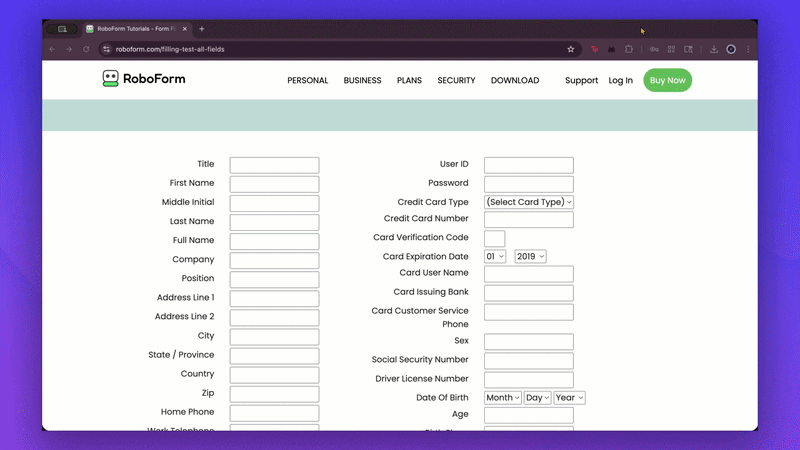

# CopyCat Browser Assistant

AI-powered browser automation using Claude's Computer Use API. Describe a task in plain language and CopyCat will see your screen and do it — clicking, typing, scrolling, and filling out forms automatically.

<p align="center">
  
</p>

<p align="center">
  <a href="https://www.tella.tv/video/vid_cmmpahvry017r04juh828flmp">
    
  </a>
</p>

## Getting Started

### Prerequisites

- Node.js 18+
- An [Anthropic API key](https://console.anthropic.com/)
- Chrome or Chromium-based browser

### Install & Build

```bash
git clone <repo-url>
cd browser-assistant
npm install
npm run build
```

### Load the Extension

1. Open `chrome://extensions`
2. Enable **Developer mode** (top right)
3. Click **Load unpacked** and select the `dist/` folder
4. Click the CopyCat icon in your toolbar to open the side panel

### Configure

Open **Settings** (gear icon) and:
- Enter your Anthropic API key
- Choose a model (Sonnet 4 or Opus 4)
- Optionally fill in your profile info for automatic form filling
- Create custom templates (e.g. "Job Application") with fields the agent can use

## Usage

1. Navigate to any website
2. Type a prompt like *"Fill out this form with my job application info"*
3. Hit **Go** — the agent takes a screenshot, plans its actions, and executes them
4. Each step shows the agent's reasoning and a screenshot of what it sees
5. Click **Stop** to cancel at any time

## Development

```bash
npm run dev    # watch mode — rebuilds on file changes
npm run build  # production build
```

After rebuilding, go to `chrome://extensions` and click the refresh icon on CopyCat to reload.

## Architecture

```
User prompt → Screenshot (1024x768) → Anthropic API → Parse actions
                                                          ↓
                              Execute via Chrome Debugger API
                                                          ↓
                                    New screenshot → Loop until done
```

- **Side panel** (React + Zustand) — chat UI with reasoning chain
- **Service worker** — orchestrates the agent loop
- **Anthropic API** — direct fetch to Claude Computer Use (`computer-use-2025-01-24` beta)
- **Chrome Debugger API** — executes clicks, keystrokes, and scrolling via CDP
- **Screenshot service** — captures and scales to 1024x768 via OffscreenCanvas

## Project Structure

```
src/
├── background/service-worker.ts   # Agent loop
├── content/content-script.ts      # Minimal content script
├── services/
│   ├── anthropicApi.ts            # API client + system prompt
│   ├── screenshotService.ts       # Capture + scale screenshots
│   ├── debuggerService.ts         # Chrome Debugger wrapper
│   └── actionExecutor.ts          # Map actions → CDP commands
├── sidepanel/
│   ├── App.tsx                    # Main app shell
│   ├── store/agentStore.ts        # Zustand state
│   ├── hooks/                     # useSettings, useAgentLoop, useAutoScroll
│   └── components/                # Header, PromptInput, ReasoningChain, Settings
└── types/                         # TypeScript definitions
```

## License

MIT
